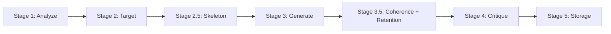

# Prismatic Engine 🔮

**AI-powered content generation pipeline for Instagram** — Harvests raw content, classifies atomic insights, schedules strategically, and generates publication-ready Reels, Carousels, and Quotes.

[](https://www.python.org/downloads/)
[](https://fastapi.tiangolo.com/)
[](https://www.postgresql.org/)

---

## Overview

Prismatic Engine is a **5-phase content pipeline** that transforms raw material (Reddit posts, books, blogs) into Instagram-ready content through LLM-powered analysis, classification, and generation.

```
Raw Content → Classification → Strategy → Creation → Delivery
```

## Architecture

| Phase | Purpose |
|-------|---------|
| **Ingestion** | Harvest content from Reddit, books (PDF), and blogs into a unified format |
| **Classification** | LLM extracts atomic components, classifies pillars, and scores virality |
| **Strategy** | Generate 21-slot weekly schedules with anti-repetition and diversity scoring |
| **Creation** | 7-stage LLM pipeline produces Reels, Carousels, Quotes with retention optimization |
| **Delivery** | Export to Markdown and Telegram for review and publication |

## The 7-Stage Creation Pipeline



- **Stage 1**: Extract psychological core (core truth + counter-truth)
- **Stage 2**: Design mode sequence (Manson Protocol) and emotional arc
- **Stage 2.5**: Build structural skeleton with tension/resolution chains
- **Stage 3**: Generate format-specific content following skeleton
- **Stage 3.5**: Audit coherence AND retention mechanics
- **Stage 4**: Self-critique with 7-criteria evaluation and rewrite loop
- **Stage 5**: Hard filters and storage

## Key Features

- **8 Content Pillars**: Relationships, Productivity, Dark Psychology, Self-Awareness, and more
- **4 Voice Modes**: ROAST_MASTER, ORACLE, MIRROR, SURGEON with hybrid transitions
- **Anti-Repetition**: 6-week atom cooldown, 12-week atom+angle cooldown, pillar saturation limits
- **Retention-Optimized**: Hook implementation, screenshot isolation, open loop endings
- **Shannon Entropy**: Diversity scoring for balanced content distribution

## Tech Stack

- **Backend**: FastAPI + SQLModel + PostgreSQL
- **LLM**: OpenAI GPT-4 with structured outputs
- **Queue**: AsyncIO with concurrency control
- **Delivery**: Telegram Bot API + Markdown export

## Quick Start

```bash
# Clone and setup
git clone https://github.com/yourusername/prismatic-engine.git
cd prismatic-engine
pip install -r requirements.txt

# Configure environment
cp .env.example .env
# Edit .env with your API keys

# Run migrations
alembic upgrade head

# Start server
uvicorn app.main:app --reload
```

## API Endpoints

| Endpoint | Description |
|----------|-------------|
| `POST /ingestion/reddit` | Harvest Reddit posts |
| `POST /classification/batch` | Classify raw content into atoms |
| `POST /strategy/generate-week` | Generate weekly schedule |
| `POST /creation/run-pipeline` | Run 7-stage creation pipeline |
| `POST /delivery/export` | Export to Markdown/Telegram |

## Documentation

See [`docs/PRISMATIC_ENGINE_DOCUMENTATION.md`](docs/PRISMATIC_ENGINE_DOCUMENTATION.md) for comprehensive technical documentation.

## License

MIT License - See [LICENSE](LICENSE) for details.
