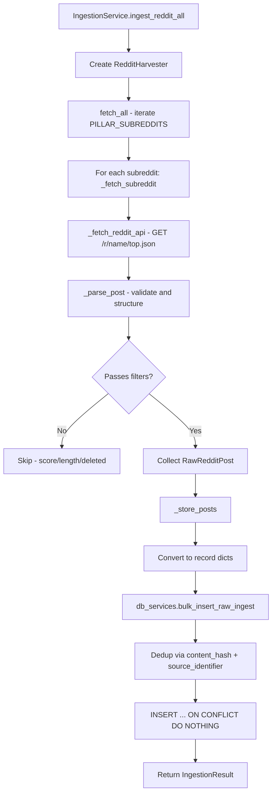
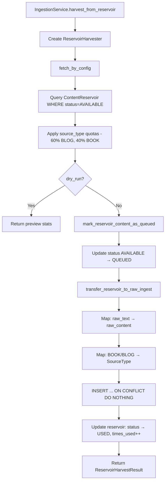
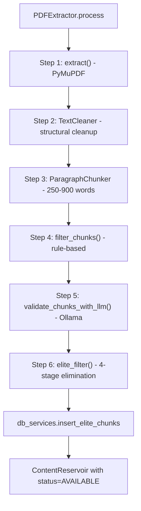
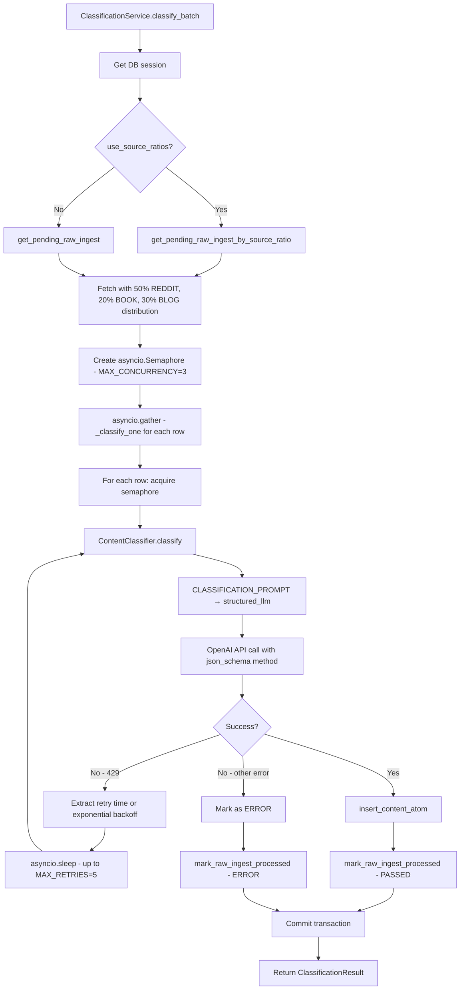
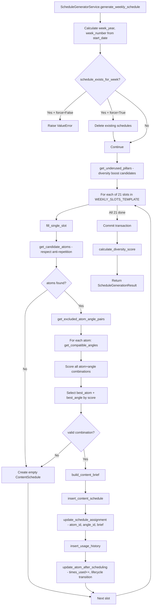
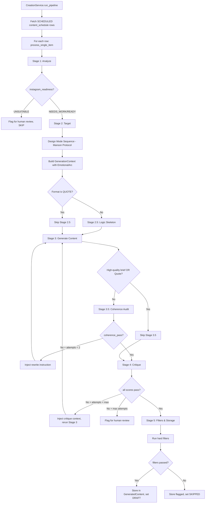
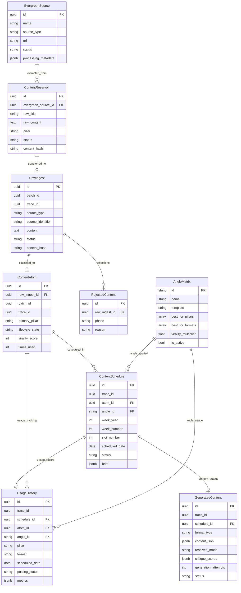
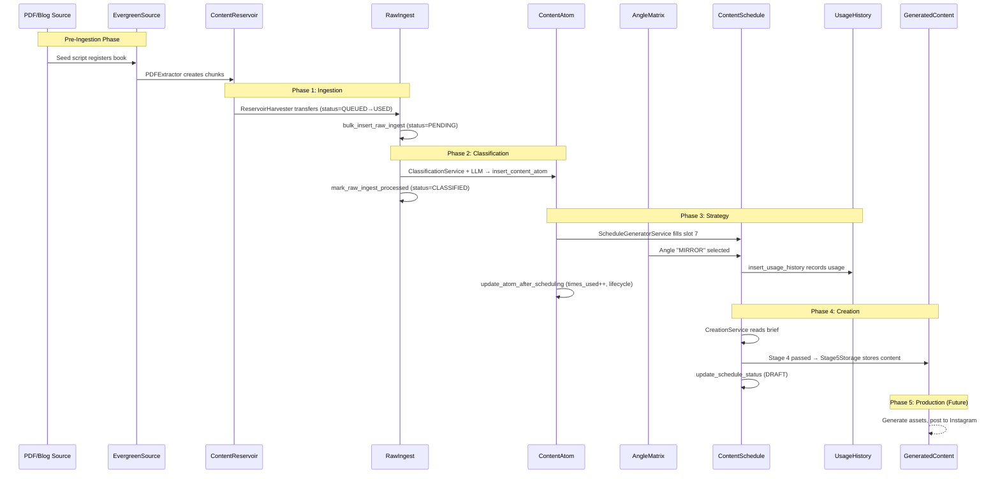

# PHASE 1: Ingestion

## Purpose

The Ingestion phase collects raw content from external sources and internal reservoirs, normalizes it into a unified format, and persists it in the `raw_ingest` table for downstream classification processing. This phase handles content deduplication, basic validation, and establishes content provenance through batch and trace IDs.

---

## Execution Pattern

| Aspect | Implementation |
|--------|----------------|
| **Trigger** | Manual invocation via API endpoints or service methods |
| **Mode** | Batch-oriented with configurable batch sizes |
| **Async** | Reddit harvesting is async; Reservoir harvesting is synchronous |
| **Concurrency** | Sequential subreddit fetching with rate limiting (2s delay) |

---

## Core Components

### Orchestration Layer

| File | Responsibility |
|------|---------------|
| [`service.py`](file:///Users/ngcaditya/PycharmProjects/Prismatic-Engine/app/ingestion/service.py) | **IngestionService** - Single entry point for all ingestion operations. Coordinates harvesters, calls DB services, manages `batch_id` and `trace_id`. |
| [`db_services.py`](file:///Users/ngcaditya/PycharmProjects/Prismatic-Engine/app/ingestion/db_services.py) | All database CRUD operations for ingestion tables. Pure data layer with no business logic. |
| [`validators.py`](file:///Users/ngcaditya/PycharmProjects/Prismatic-Engine/app/ingestion/validators.py) | Pure validation functions with structured rejection reasons. No side effects. |

### Harvesters

| File | Responsibility |
|------|---------------|
| [`harvesters/reddit.py`](file:///Users/ngcaditya/PycharmProjects/Prismatic-Engine/app/ingestion/harvesters/reddit.py) | **RedditHarvester** - Fetches top posts from Reddit, parses and validates. No DB writes. |
| [`harvesters/reservoir.py`](file:///Users/ngcaditya/PycharmProjects/Prismatic-Engine/app/ingestion/harvesters/reservoir.py) | **ReservoirHarvester** - Queries `content_reservoir` for pre-processed content. No DB writes. |
| [`harvesters/reservoir_config.py`](file:///Users/ngcaditya/PycharmProjects/Prismatic-Engine/app/ingestion/harvesters/reservoir_config.py) | Pydantic config for quota-based content distribution (60% blog, 40% book). |

### Reservoir Subsystem (Pre-Ingestion Pipeline)

| File | Responsibility |
|------|---------------|
| [`reservoir/pdf_extractor.py`](file:///Users/ngcaditya/PycharmProjects/Prismatic-Engine/app/ingestion/reservoir/pdf_extractor.py) | **PDFExtractor** - 6-stage pipeline: extract → clean → chunk → hard filter → LLM validate → elite filter |
| [`reservoir/cleaner.py`](file:///Users/ngcaditya/PycharmProjects/Prismatic-Engine/app/ingestion/reservoir/cleaner.py) | **TextCleaner** - Removes headers, footers, TOC, back matter |
| [`reservoir/chunker/paragraph_chunker.py`](file:///Users/ngcaditya/PycharmProjects/Prismatic-Engine/app/ingestion/reservoir/chunker/paragraph_chunker.py) | **ParagraphChunker** - Splits text into 250-900 word chunks |
| [`reservoir/filter/`](file:///Users/ngcaditya/PycharmProjects/Prismatic-Engine/app/ingestion/reservoir/filter) | **HardFilter** - Rule-based binary PASS/DROP decisions |
| [`reservoir/elimination/`](file:///Users/ngcaditya/PycharmProjects/Prismatic-Engine/app/ingestion/reservoir/elimination) | **EliteFilter** - 4-stage elimination gate for Instagram-viral content |

---

## Workflow (Step-by-Step)

### Path A: Reddit Ingestion



**Filters Applied in RedditHarvester:**
1. `is_self` must be `True` (text posts only)
2. `selftext` not in `["[removed]", "[deleted]"]`
3. `score >= min_score` (default: 10)
4. Post within `lookback_days` (default: 7)
5. `selftext` length >= `min_content_length` (default: 300)

---

### Path B: Reservoir Ingestion



---

### Path C: Pre-Ingestion (Book Processing)



---

## Data Flow

### Inputs

| Source | Format | Fetched By |
|--------|--------|-----------|
| Reddit API | JSON (`/r/{name}/top.json`) | `RedditHarvester` |
| ContentReservoir | SQLModel records | `ReservoirHarvester` |
| PDF files | Binary (via PyMuPDF) | `PDFExtractor` |

### Outputs

| Target | Format | Written By |
|--------|--------|-----------|
| `raw_ingest` table | SQLModel `RawIngest` | `db_services.bulk_insert_raw_ingest` |
| `content_reservoir` table | SQLModel `ContentReservoir` | `db_services.insert_elite_chunks` |

---

## Database Interactions

### Tables Read

| Table | Query Purpose |
|-------|---------------|
| `content_reservoir` | Fetch AVAILABLE chunks for reservoir harvesting |
| `raw_ingest` | Check existing `content_hash` and `source_identifier` for dedup |
| `evergreen_sources` | Get or create source metadata for books/blogs |

### Tables Written

| Table | Write Purpose |
|-------|---------------|
| `raw_ingest` | Primary output - normalized content awaiting classification |
| `content_reservoir` | Store elite chunks from PDF processing; update lifecycle status |
| `evergreen_sources` | Track book/blog processing status |
| `rejected_content` | Store rejection records (function exists but not called in main paths) |

### State Transitions

**RawIngest:**
```
(created) → PENDING → [next phase handles: PROCESSING → PASSED/REJECTED]
```

**ContentReservoir:**
```
AVAILABLE → QUEUED → USED → [COOLDOWN → AVAILABLE]
```

**EvergreenSource:**
```
PENDING → PROCESSING → COMPLETED/FAILED
```

---

## Failure & Edge Handling

### Implemented

| Scenario | Handling |
|----------|----------|
| Reddit 429 rate limit | Retry once after `Retry-After` header (or 60s default) |
| Content hash collision | `ON CONFLICT DO NOTHING` - silent skip |
| Source identifier collision | `ON CONFLICT DO NOTHING` - silent skip |
| Empty subreddit response | Log and continue to next subreddit |
| PDF extraction failure | Logged, error_message stored in EvergreenSource |
| Chunk below word count | Filtered out by HardFilter |

### NOT Implemented

| Gap | Notes |
|-----|-------|
| Dead letter queue | Failed records are not stored for retry |
| Transactional rollback | Partial batch success is committed |
| Alerting | No notification on systematic failures |
| Retry for non-429 HTTP errors | Single attempt only |

---

## Explicit Non-Responsibilities

This phase **intentionally does NOT**:

- **Classify content** - No pillar assignment or content atom extraction
- **Apply LLM enrichment** - Reddit content is stored raw
- **Manage scheduling** - No time-based triggers
- **Produce final content** - Only collects raw material
- **Validate semantic quality** - Only basic length/score checks
- **Handle publication** - Purely an ingestion layer

---

## Key Data Structures

### RawIngest (Primary Output)

```python
RawIngest:
    id: UUID (PK)
    trace_id: UUID  # For debugging across phases
    source_type: SourceType  # REDDIT, BOOK, BLOG, etc.
    source_url: str (optional)
    source_identifier: str (unique per source_type)
    raw_content: str
    raw_title: str (optional)
    raw_metadata: JSONB  # Includes pillar, author, scores, etc.
    status: IngestStatus  # PENDING → downstream phases
    batch_id: UUID
    ingested_at: timestamp
    content_hash: str (computed MD5)
```

### ContentReservoir (Intermediate Storage)

```python
ContentReservoir:
    id: UUID (PK)
    source_id: UUID (FK → evergreen_sources)
    raw_text: str
    raw_title: str (optional)
    chunk_index: int
    source_type: str  # Denormalized
    source_name: str
    source_author: str
    status: ReservoirStatus  # AVAILABLE/QUEUED/USED/COOLDOWN
    times_used: int
    last_used_at: timestamp
    cooldown_until: timestamp
```

---

## Configuration

### Reddit Harvester Defaults

```python
HarvesterConfig:
    posts_per_subreddit: 10
    lookback_days: 7
    request_delay_seconds: 2.0
    min_score: 10
    min_content_length: 300
    timeout_seconds: 30.0
```

### Reservoir Quota Distribution

```python
ReservoirHarvesterConfig:
    source_type_quotas:
        BLOG: 60%
        BOOK: 40%
    pillar_quotas:
        RELATIONSHIPS: 5
        PRODUCTIVITY: 3
        DARK_PSYCHOLOGY: 3
        ...  # Total: 26 items per harvest
```

---
---

# PHASE 2: Classification

## Purpose

The Classification phase transforms raw ingested content into structured, reusable "content atoms" by using LLM-based analysis. It extracts atomic components (core concept, emotional hook, supporting evidence, actionable insight, quotable snippet), classifies content across multiple dimensions (pillar, format fit, complexity, emotional triggers), and assigns virality scores. This phase bridges raw content and downstream content creation.

---

## Execution Pattern

| Aspect | Implementation |
|--------|----------------|
| **Trigger** | Manual invocation via `ClassificationService.classify_batch()` |
| **Frequency** | Once per week (as documented) |
| **Mode** | Async batch with concurrency control |
| **Concurrency** | 3 parallel LLM calls (reduced from 10 to stay within TPM limits) |
| **Expected Runtime** | 1-5 minutes for ~100 rows |
| **Rate Limiting** | Exponential backoff with up to 5 retries |

---

## Core Components

| File | Responsibility |
|------|---------------|
| [`services.py`](file:///Users/ngcaditya/PycharmProjects/Prismatic-Engine/app/classification/services.py) | **ClassificationService** - Single entry point orchestrator. Fetches pending records, runs LLM with concurrency, handles rate limits, inserts atoms. |
| [`classifier.py`](file:///Users/ngcaditya/PycharmProjects/Prismatic-Engine/app/classification/classifier.py) | **ContentClassifier** - LangChain + OpenAI wrapper with `with_structured_output()` for deterministic JSON. |
| [`schemas.py`](file:///Users/ngcaditya/PycharmProjects/Prismatic-Engine/app/classification/schemas.py) | Pydantic schemas defining LLM output contract: `AtomicComponents`, `ClassificationDimensions`, `ClassificationOutput`. |
| [`prompts.py`](file:///Users/ngcaditya/PycharmProjects/Prismatic-Engine/app/classification/prompts.py) | **The Librarian** persona - System/human prompt templates for LLM classification. |
| [`db_services.py`](file:///Users/ngcaditya/PycharmProjects/Prismatic-Engine/app/classification/db_services.py) | Database CRUD operations for `ContentAtom` insertion and `RawIngest` status updates. |

---

## Workflow (Step-by-Step)



---

## Data Flow

### Inputs

| Source | Format | Access Pattern |
|--------|--------|---------------|
| `raw_ingest` table | SQLModel `RawIngest` | WHERE `status = PENDING`, ordered by `ingested_at ASC` |
| Source ratio config | Dict `{"REDDIT": 0.5, "BOOK": 0.2, "BLOG": 0.3}` | Configurable per-service instance |

### Outputs

| Target | Format | Contents |
|--------|--------|----------|
| `content_atoms` table | SQLModel `ContentAtom` | Extracted atomic components, classification dimensions, virality score |
| `raw_ingest` table | Status update | `PENDING → PASSED` or `PENDING → ERROR` |

---

## LLM Classification Pipeline

### The Librarian Persona

The LLM is prompted to act as "The Librarian" — an expert content taxonomist. It:
1. **EXTRACTS** atomic components (reusable building blocks)
2. **CLASSIFIES** content across multiple dimensions
3. **ESTIMATES** viral potential for Instagram

### Structured Output Schema

```python
ClassificationOutput:
    atomic_components: AtomicComponents
        core_concept: str        # Central insight (1-3 sentences)
        emotional_hook: str      # Pain point or emotional truth
        supporting_evidence: str # Research, anecdote, statistic
        actionable_insight: str  # Practical takeaway
        quotable_snippet: str    # Punchy line (<25 words)
    
    classification: ClassificationDimensions
        primary_pillar: ContentPillar    # 1 of 8 pillars
        secondary_pillars: List[ContentPillar]  # Up to 3
        format_fit: List[Format]         # REEL, CAROUSEL, QUOTE
        complexity_score: int            # 1-5 scale
        emotional_triggers: List[EmotionalTrigger]
        proof_type: ProofType
        hook_mechanism: HookMechanism
    
    virality_estimate: float  # 0-10
    confidence: float         # 0-1
    classification_notes: Optional[str]
```

---

## Database Interactions

### Tables Read

| Table | Query Purpose |
|-------|---------------|
| `raw_ingest` | Fetch `PENDING` records for classification |

### Tables Written

| Table | Write Purpose |
|-------|---------------|
| `content_atoms` | Insert classified content with atomic components |
| `raw_ingest` | Update status to `PASSED` or `ERROR`, set `processed_at` |

### State Transitions

**RawIngest:**
```
PENDING → PASSED   (successful classification)
PENDING → ERROR    (all retries exhausted)
```

**ContentAtom:**
```
(created) → lifecycle_state=ACTIVE, verification_status=UNVERIFIED
```

---

## ContentAtom Data Structure

```python
ContentAtom:
    id: UUID (PK)
    trace_id: UUID  # Links to original RawIngest
    raw_ingest_id: UUID (FK)
    
    # Raw source (preserved)
    raw_content: str
    source_url: str
    source_type: SourceType
    source_metadata: JSONB  # {raw_title, raw_metadata, batch_id}
    
    # Classification
    primary_pillar: ContentPillar
    secondary_pillars: ARRAY[Text]
    format_fit: ARRAY[Text]  # ["QUOTE", "CAROUSEL", "REEL"]
    complexity_score: int (1-5)
    classification: JSONB  # {emotional_triggers, proof_type, hook_mechanism}
    
    # Atomic components
    atomic_components: JSONB  # {core_concept, emotional_hook, supporting_evidence, ...}
    
    # Performance
    virality_score: float (0-10)
    confidence_score: float (0-1)
    times_used: int
    last_used_at: timestamp
    
    # Lifecycle
    lifecycle_state: LifecycleState  # ACTIVE, COOLING, ARCHIVED, etc.
    verification_status: VerificationStatus  # UNVERIFIED, VERIFIED, FLAGGED
    
    # Embeddings (for future semantic search)
    content_embedding: Vector(1536)
```

---

## Rate Limiting & Retry Logic

### Configuration

```python
MAX_CONCURRENCY = 3       # Parallel LLM calls
MAX_RETRIES = 5           # Per-record retry attempts
BASE_DELAY_SECONDS = 2.0  # Initial backoff
MAX_DELAY_SECONDS = 60.0  # Cap on backoff
```

### Retry Algorithm

1. Catch exception during LLM call
2. Check if error contains "429" or "rate_limit"
3. Try to extract wait time from error message (e.g., "try again in 2.5s")
4. If not found, use exponential backoff: `min(BASE * 2^attempt + jitter, MAX)`
5. Sleep and retry up to `MAX_RETRIES` times
6. Non-429 errors fail immediately (no retry)

---

## Failure & Edge Handling

### Implemented

| Scenario | Handling |
|----------|----------|
| OpenAI 429 rate limit | Exponential backoff with up to 5 retries |
| LLM output validation failure | Classification fails, marked as ERROR |
| DB insert failure | Logged, marked as ERROR |
| Empty pending queue | Early return with empty result |
| Partial batch failure | Individual failures don't stop batch; committed at end |

### NOT Implemented

| Gap | Notes |
|-----|-------|
| Dead letter queue | Failed records remain in ERROR state |
| Automatic re-processing | No mechanism to retry ERROR records |
| Fallback models | No secondary LLM if primary fails |
| Content too long | No truncation before LLM call |

---

## Explicit Non-Responsibilities

This phase **intentionally does NOT**:

- **Fetch raw content** - Expects `raw_ingest` records to exist
- **Produce final Instagram content** - Only extracts atomic components
- **Schedule content** - No calendar or slot logic
- **Generate embeddings** - `content_embedding` field exists but is not populated
- **Verify facts** - Sets `verification_status=UNVERIFIED` by default
- **Handle multimedia** - Text-only classification

---

## Configuration

### Default Source Type Distribution

```python
DEFAULT_SOURCE_RATIOS = {
    "REDDIT": 0.50,  # 50% Reddit posts
    "BOOK": 0.20,    # 20% Book chunks
    "BLOG": 0.30,    # 30% Blog articles
}
```

### LLM Configuration

```python
ContentClassifier:
    model: settings.LLM_MODEL  # Configurable via environment
    temperature: 0             # Deterministic output
    method: "json_schema"      # Structured output enforcement
```

---
---

# PHASE 3: Strategy (Remix Engine)

## Purpose

The Strategy phase generates a complete weekly content schedule by selecting the optimal atom + angle combinations for 21 posting slots. It applies anti-repetition rules to ensure content freshness, calculates diversity scores using Shannon entropy, builds self-contained content briefs for downstream creation, and records usage history for future exclusion. This phase is also called the "Remix Engine."

---

## Execution Pattern

| Aspect | Implementation |
|--------|----------------|
| **Trigger** | Manual invocation via `ScheduleGeneratorService.generate_weekly_schedule()` |
| **Frequency** | Every Sunday evening to generate the upcoming week |
| **Mode** | Synchronous batch processing |
| **Scope** | 21 slots per week (3 posts/day × 7 days) |
| **Output** | `content_schedule` and `usage_history` records |

---

## Core Components

| File | Responsibility |
|------|---------------|
| [`services.py`](file:///Users/ngcaditya/PycharmProjects/Prismatic-Engine/app/strategy/services.py) | **ScheduleGeneratorService** - Main orchestrator. Fills 21 slots with atom+angle combinations, builds briefs, commits to DB. |
| [`anti_repetition.py`](file:///Users/ngcaditya/PycharmProjects/Prismatic-Engine/app/strategy/anti_repetition.py) | Cooldown rules, pillar saturation checks, diversity scoring (Shannon entropy), candidate selection. |
| [`weekly_slots.py`](file:///Users/ngcaditya/PycharmProjects/Prismatic-Engine/app/strategy/weekly_slots.py) | Static 21-slot template with day, time, pillar, format, priority per slot. |
| [`lifecycle_manager.py`](file:///Users/ngcaditya/PycharmProjects/Prismatic-Engine/app/strategy/lifecycle_manager.py) | Atom state transitions: ACTIVE → COOLING → ARCHIVED → RETIRED/RESURRECTED. |
| [`db_services.py`](file:///Users/ngcaditya/PycharmProjects/Prismatic-Engine/app/strategy/db_services.py) | CRUD for ContentSchedule, UsageHistory; read queries for ContentAtom, AngleMatrix. |
| [`seed_angle_scripts.py`](file:///Users/ngcaditya/PycharmProjects/Prismatic-Engine/app/strategy/seed_angle_scripts.py) | Seed data for AngleMatrix table. |

---

## Workflow (Step-by-Step)



---

## The 21-Slot Weekly Template

```
┌─────────────┬──────────┬──────────┬──────────┐
│     Day     │ 08:00 AM │ 12:00 PM │ 06:00 PM │
├─────────────┼──────────┼──────────┼──────────┤
│ Monday      │ QUOTE    │ CAROUSEL │ REEL     │
│ Tuesday     │ QUOTE    │ CAROUSEL │ REEL     │
│ Wednesday   │ QUOTE    │ CAROUSEL │ REEL     │
│ Thursday    │ QUOTE    │ CAROUSEL │ REEL     │
│ Friday      │ QUOTE    │ CAROUSEL │ REEL     │
│ Saturday    │ QUOTE    │ REEL     │ CAROUSEL │
│ Sunday      │ QUOTE    │ CAROUSEL │ REEL     │
└─────────────┴──────────┴──────────┴──────────┘
```

**Distribution:**
- ~7 Quotes, ~7 Carousels, ~7 Reels
- Each pillar appears 2-3 times per week
- High-engagement slots (Tue/Thu evening) get viral-friendly pillars

---

## Anti-Repetition Rules

### Configuration

```python
AntiRepetitionConfig:
    atom_cooldown_weeks: 6       # Same atom (any angle) cannot reuse
    atom_angle_cooldown_weeks: 12  # Same atom + same angle cannot reuse
    pillar_saturation_limit: 0.4   # Max 40% of recent posts from one pillar
    lookback_weeks: 4              # Weeks to check for saturation
    min_atoms_before_reuse: 50     # Minimum unique atoms before allowing reuse
```

### Rule Enforcement

1. **Atom Cooldown**: `get_excluded_atom_ids()` returns atoms used in last 6 weeks
2. **Atom+Angle Cooldown**: `get_excluded_atom_angle_pairs()` returns pairs used in last 12 weeks
3. **Pillar Saturation**: `is_pillar_oversaturated()` checks if pillar > 40% of recent usage

---

## Scoring Algorithm

```python
def calculate_candidate_score(atom, angle, pillar, underused_pillars, slot_priority):
    score = atom.virality_score × angle.virality_multiplier
    
    # Priority boost for high-priority slots (evening, viral-friendly)
    if slot_priority == 1:
        score *= 1.2
    
    # Diversity boost for underused pillars
    if pillar in underused_pillars:
        score *= 1.15
    
    # Penalty for low-credibility with scientific angles
    if angle.constraints.get("requires_proof") and credibility == "LOW":
        score *= 0.5
    
    return score
```

---

## Content Brief Structure

The brief is **self-contained** — Phase 5 (Creation) should not need to query other tables.

```python
brief = {
    # Identifiers
    "atom_id": str,
    "angle_id": str,
    
    # Creative direction
    "angle_template": str,  # The angle's template text
    "angle_name": str,
    "pillar": str,
    "format": str,  # "REEL", "CAROUSEL", "QUOTE"
    "target_emotions": List[str],  # e.g., ["EMPOWERMENT", "CURIOSITY"]
    "tone": str,
    "complexity": int,  # 1-5
    
    # Source content (THE KEY PART)
    "raw_content": str,
    "atomic_components": {
        "core_concept": str,
        "emotional_hook": str,
        "supporting_evidence": str,
        "actionable_insight": str,
        "quotable_snippet": str,
    },
    
    # Content signals
    "classification": dict,  # emotional_triggers, proof_type, hook_mechanism
    
    # Metadata
    "slot_number": int,
    "slot_priority": int,
    "slot_notes": str,
    
    # Angle constraints
    "angle_constraints": dict,
    "angle_example": str,
}
```

---

## Database Interactions

### Tables Read

| Table | Query Purpose |
|-------|---------------|
| `content_atoms` | Fetch ACTIVE atoms matching pillar/format, exclude recently used |
| `angle_matrix` | Get compatible angles by pillar/format/complexity |
| `usage_history` | Check cooldown periods, calculate pillar saturation |

### Tables Written

| Table | Write Purpose |
|-------|---------------|
| `content_schedule` | Create 21 slots with atom/angle assignments and briefs |
| `usage_history` | Record each atom+angle usage for anti-repetition |
| `content_atoms` | Update `times_used`, `last_used_at`, `lifecycle_state` |

### State Transitions

**ContentSchedule:**
```
(created) → status=SCHEDULED → [downstream phases update to CREATING, DRAFT, etc.]
```

**ContentAtom (on scheduling):**
```
ACTIVE → COOLING  (if enable_cooling=True)
ACTIVE → ARCHIVED (if times_used >= max_uses_before_archive)
```

**UsageHistory:**
```
(created) → posting_status=GENERATED → [downstream: DELIVERED, POSTED, etc.]
```

---

## Lifecycle Manager

### States

```
ACTIVE → COOLING → ACTIVE (after cooling_duration_days)
       → ARCHIVED (after max_uses_before_archive)
         → RESURRECTED (after min_rest_weeks_for_resurrection)
         → RETIRED (manual or auto-retire)
```

### Configuration

```python
LifecycleConfig:
    enable_cooling: True
    cooling_duration_days: 30
    max_uses_before_archive: 5
    min_rest_weeks_for_resurrection: 40
    auto_retire_after_months: 12
    min_performance_for_survival: 0.3
```

---

## Diversity Metrics

### Shannon Entropy Score

```python
def calculate_diversity_score(session, weeks, as_of_date):
    """
    Returns 0-1 score.
    0 = All posts from same pillar (no diversity)
    1 = Perfectly balanced across all 8 pillars
    """
    usage_counts = get_pillar_usage_counts(session, weeks, as_of_date)
    
    # Shannon entropy calculation
    entropy = -Σ (p_i × log2(p_i)) for each pillar
    
    # Normalize to 0-1
    max_entropy = log2(8)  # 8 pillars
    return entropy / max_entropy
```

### Underused Pillar Detection

Pillars with usage below 80% of expected (total_posts / 8 pillars) get a 1.15× scoring boost.

---

## Data Structures

### AngleMatrix

```python
AngleMatrix:
    id: str (PK)  # e.g., "contrarian", "scientific"
    name: str
    template: str  # Angle prompt template
    description: str
    
    # Compatibility
    best_for_pillars: ARRAY[Text]
    avoid_for_pillars: ARRAY[Text]
    best_for_formats: ARRAY[Text]
    avoid_for_formats: ARRAY[Text]
    constraints: JSONB  # {complexity_range, requires_proof, tone}
    
    # Performance
    virality_multiplier: float  # Default 1.0
    performance_data: JSONB
    
    is_active: bool
```

### ContentSchedule

```python
ContentSchedule:
    id: UUID (PK)
    trace_id: UUID
    
    # Slot definition
    week_year: int
    week_number: int (1-53)
    slot_number: int (1-21)
    scheduled_date: date
    scheduled_time: time
    day_of_week: str
    
    # Assignment
    atom_id: UUID (FK → content_atoms)
    angle_id: str (FK → angle_matrix)
    
    # Requirements
    required_pillar: ContentPillar
    required_format: Format
    
    # Brief (self-contained for Phase 5)
    brief: JSONB
    
    status: ScheduleStatus  # SCHEDULED, CREATING, DRAFT, etc.
```

### UsageHistory

```python
UsageHistory:
    id: UUID (PK)
    trace_id: UUID  # Full lineage to raw_ingest
    
    # References
    schedule_id: UUID (FK)
    atom_id: UUID (FK)
    angle_id: str (FK)
    
    # Denormalized (for fast analytics)
    pillar: str
    format: str
    scheduled_date: date
    week_year: int
    week_number: int
    
    # Posting lifecycle
    posting_status: PostingStatus  # GENERATED, DELIVERED, POSTED, etc.
    instagram_post_id: str
    instagram_post_url: str
    actual_posted_at: timestamp
    
    # Performance (updated by learning loop)
    metrics: JSONB  # {engagement_rate, likes, comments, saves}
    content_fingerprint: str  # For similarity detection
```

---

## Failure & Edge Handling

### Implemented

| Scenario | Handling |
|----------|----------|
| No eligible atoms for slot | Create empty ContentSchedule (atom_id=NULL) |
| No compatible angles | Fall back to `get_fallback_angles()` (any format-compatible angle) |
| Schedule already exists | Raise ValueError unless `force=True` |
| All atom+angle pairs excluded | Create empty slot, log warning |

### NOT Implemented

| Gap | Notes |
|-----|-------|
| Partial week generation | All 21 slots are always created |
| Emergency slot filling | No last-minute substitution logic |
| Performance-based angle selection | Uses static `virality_multiplier` only |

---

## Explicit Non-Responsibilities

This phase **intentionally does NOT**:

- **Create actual content** - Only generates briefs and schedules
- **Post to Instagram** - Downstream production/delivery phases handle this
- **Generate assets** - No image/video generation
- **Run on a schedule** - Manual invocation only
- **Learn from performance** - Uses static multipliers (learning loop is separate)

---
---

# PHASE 4: Creation (7-Stage Pipeline)

## Purpose

The Creation phase transforms scheduled content briefs into production-ready Instagram content (Reels, Carousels, Quotes) through a **7-stage LLM pipeline**. It analyzes source material with counter-truth extraction, resolves mode sequences using the Manson Protocol, generates logic skeletons, creates format-specific content, audits for narrative coherence, self-critiques with a rewrite loop, and stores approved content. This phase produces the actual text/scripts that will be published.

---

## Execution Pattern

| Aspect | Implementation |
|--------|----------------|
| **Trigger** | Manual invocation via `CreationService.run_pipeline()` |
| **Frequency** | Once per week (after Phase 3 scheduling) |
| **Mode** | Async batch with concurrency control |
| **Concurrency** | 3 parallel items (matching classification pattern) |
| **Expected Runtime** | 5-10 minutes for 21 items |
| **LLM Model** | `settings.CREATION_LLM_MODEL` with format-specific temperatures |

---

## Core Components

| File | Responsibility |
|------|---------------|
| [`service.py`](file:///Users/ngcaditya/PycharmProjects/Prismatic-Engine/app/creation/service.py) | **CreationService** - Main orchestrator. Runs all 7 stages with retry logic and cost optimizations. |
| [`schemas.py`](file:///Users/ngcaditya/PycharmProjects/Prismatic-Engine/app/creation/schemas.py) | Extensive Pydantic schemas: Stage1Analysis, ModeSequence, EmotionalArc, GenerationContext, Skeleton schemas, ReelContent, CarouselContent, QuoteContent, CoherenceAuditResult, CritiqueResult. |
| [`mode_matrix.py`](file:///Users/ngcaditya/PycharmProjects/Prismatic-Engine/app/creation/mode_matrix.py) | Format × Pillar → Mode resolution (8 modes) for backward compatibility. |
| [`temperature_config.py`](file:///Users/ngcaditya/PycharmProjects/Prismatic-Engine/app/creation/temperature_config.py) | Stage-specific LLM temperatures. |
| `stages/` | Individual stage handlers (Stage1Analyzer, Stage2Targeter, Stage2_5SkeletonGenerator, Stage3Generator, Stage3_5CoherenceAuditor, Stage4Critic, Stage5Storage). |
| `prompts/` | Stage-specific prompt templates (stage_1.py through stage_4.py, stage_2_5_*.py, stage_3_5_*.py, format-specific stage_3). |
| `prompts/blocks/` | Shared prompt blocks (mode definitions, voice guidelines, anti-AI rules). |
| `filters/` | Hard filter implementations for Stage 5 (character_limits.py, prohibited_phrases.py, structure_checks.py). |
| [`db_services.py`](file:///Users/ngcaditya/PycharmProjects/Prismatic-Engine/app/creation/db_services.py) | CRUD for GeneratedContent, ContentSchedule status updates. |

---

## The 7-Stage Pipeline



---

## Stage Details

### Stage 1: Analyze (Revised)

**Purpose:** Extract psychological core from content brief, including both the **destination (core_truth)** and **starting point (counter_truth)**, and assess Instagram readiness.

**Key Change:** Now extracts the **counter-truth** — the comfortable lie, delusion, or anxiety the audience currently holds. This enables proper narrative arc construction (State A → State B) in downstream stages.

**Inputs:**
- `ContentSchedule.brief` (from Phase 3)
- `required_pillar`, `required_format`

**Outputs:** `Stage1Analysis`
```python
Stage1Analysis:
    core_truth: str              # THE DESTINATION - the irreducible insight
    counter_truth: str           # THE STARTING POINT - the lie/delusion the audience holds
    contrast_pair: str           # A→B journey: "FROM [counter_truth] TO [core_truth]"
    brief_quality_score: int     # 1-10 (7 is average)
    brief_quality_issues: List[str]  # Specific issues found
    requires_heavy_reframe: bool
    suggested_reframe: Optional[str]
    emotional_core: EmotionalCore  # primary_emotion, secondary_emotion, why_someone_shares_this
    strongest_hook_in_material: str
    instagram_readiness: "READY" | "NEEDS_WORK" | "UNSUITABLE"
    unsuitable_reason: Optional[str]
```

**The Counter-Truth Rule:**
> Every piece of content is a journey from State A to State B:
> - **State A (Counter-Truth)**: The lie, delusion, cope, or anxiety the audience currently holds
> - **State B (Core Truth)**: The insight that replaces the lie
>
> The counter-truth feeds the ROAST (opener) and MIRROR (bridge) modes.
> The core truth feeds the ORACLE (closer) mode.

**Exit Condition:** If `UNSUITABLE`, skip all remaining stages and flag for human review.

---

### Stage 2: Target (Revised - Manson Protocol)

**Purpose:** Design the **Mode Sequence** (Manson Protocol) and **Continuous Emotional Arc** for the content.

**Key Change:** No longer assigns a single mode. Instead, designs a **3-part mode journey** (opener → bridge → closer) with per-step energy levels. Uses **EmotionalArc** (5-stage continuous arc) instead of discrete EmotionalJourney.

**The Manson Protocol (Trust-Building Arc):**
| Stage | Function | Typical Modes |
|-------|----------|---------------|
| **Opener** | The Callout — create dissonance, wake them up | ROAST_MASTER, sharp ORACLE |
| **Bridge** | The Validation — soften, show you understand the pain | MIRROR |
| **Closer** | The Truth — reveal the mechanism, give them the truth | ORACLE, SURGEON |

> A 60-second Roast is not entertainment. It is verbal abuse.
> A 10-slide Oracle is not revelation. It is a lecture.
> **Trust requires CONTRAST.** Mean then kind. Confusing then clear.

**8 Available Modes:**
| Mode | Description | Energy Level |
|------|-------------|--------------|
| ROAST_MASTER | Direct call-out, behavior naming, no softness | High (0.7-1.0) |
| MIRROR | Recognition without advice, "being seen" energy | Medium (0.4-0.6) |
| ORACLE | Mechanism reveal, prophecy-like truth delivery | Variable (0.3-0.8) |
| SURGEON | Tactical precision, no emotional fluff | Low-Medium (0.2-0.5) |
| ROAST_TO_SURGEON | Opens with roast, delivers surgical breakdown | Opener+Closer hybrid |
| ROAST_TO_MIRROR | Exposes false belief, then recognition of truth | Opener+Bridge hybrid |
| ORACLE_SURGEON | Mechanism + structure hybrid | Closer only |
| ORACLE_COMPRESSED | One-line mechanism delivery | Quotes only |

**Outputs:** 

**ModeSequence (NEW):**
```python
ModeSequence:
    opener: ModeStep  # {mode, function, energy}
    bridge: ModeStep  # {mode, function, energy}
    closer: ModeStep  # {mode, function, energy}

ModeStep:
    mode: str              # e.g., "ROAST_MASTER"
    function: str          # What this mode achieves at this point
    energy: float          # 0.0 (calm) to 1.0 (intense)
```

**EmotionalArc (NEW - Replaces EmotionalJourney):**
```python
EmotionalArc:
    entry_state: str              # Where they are before (unconscious avoidance)
    destabilization_trigger: str  # The moment of recognition
    resistance_point: str         # Where they want to dismiss this
    breakthrough_moment: str      # The reframe they can't unsee
    landing_state: str            # Implication, not resolution
    pacing_note: str              # Timing guidance
```

**GenerationContext (Revised):**
```python
GenerationContext:
    # From ContentSchedule
    schedule_id, trace_id, required_format, required_pillar, brief
    
    # From Stage 1 (NEW fields)
    core_truth: str          # THE DESTINATION
    counter_truth: str       # THE STARTING POINT
    contrast_pair: str       # The A→B journey phrase
    requires_heavy_reframe: bool
    suggested_reframe: Optional[str]
    strongest_hook: str
    primary_emotion, secondary_emotion: str
    
    # From Stage 2: NEW Mode Sequence (Manson Protocol)
    mode_sequence: ModeSequence  # opener → bridge → closer
    emotional_arc: EmotionalArc  # 5-stage continuous arc
    tone_shift_instruction: str  # e.g., "Start sharp → Move clinical → End warm"
    
    # From Stage 2: Engagement triggers
    physical_response_goal: str  # Somatic, not cognitive
    share_trigger: str
    share_target: str           # SPECIFIC person type (not "friends")
    
    # Backward compatibility
    resolved_mode: str           # Primary mode (opener.mode)
    structural_note: Optional[str]  # DEPRECATED
    emotional_journey: Optional[EmotionalJourney]  # DEPRECATED
    
    # Rewrite context (populated on Stage 4 retry)
    rewrite_focus: Optional[str]
    specific_failures: List[CritiqueFailure]
    ai_voice_violations: List[str]
    attempt_number: int  # 1, 2, or 3
```

---

### Stage 2.5: Logic Skeleton (NEW)

**Purpose:** Construct the **structural plan** before any copy is written. Ensures psychological sequence, not merely visual adjacency.

**When Applied:**
- **CAROUSEL**: Full skeleton with slide-by-slide specification
- **REEL**: Beat structure with pacing and breath points
- **QUOTE**: Skipped (single-line content doesn't need skeleton)

**The Golden Thread Rule:**
> Each unit must:
> 1. RESOLVE a tension from the previous unit, OR
> 2. INTRODUCE a specific tension that only the next unit can resolve
>
> For any two adjacent units, this must be true:
> "Since [Unit N] establishes X, then [Unit N+1] naturally follows with Y."

**Carousel Skeleton:**
```python
CarouselSkeleton:
    narrative_arc_summary: str  # "From [State A] to [State B] via [Mechanism]"
    total_slides: int           # 6-10 slides
    skeleton: List[CarouselSlideSpec]
    phase_structure: Dict[str, CarouselPhaseSpec]  # THE_TRAP, THE_SHIFT, THE_RELEASE
    tone_progression: str       # e.g., "Sharp (1-2) → Clinical (3-5) → Warm (6-8)"
    dependency_chain_valid: bool
    golden_thread_test: str     # The complete "Since... Then..." chain

CarouselSlideSpec:
    slide: int              # 1-indexed
    phase: str              # THE_TRAP, THE_SHIFT, or THE_RELEASE
    mode: str               # Mode for this slide (can include transitions)
    purpose: str            # What this slide must accomplish
    energy_level: float     # 0.0-1.0
    resolves_tension: Optional[str]  # What tension from previous slide this resolves
    creates_tension: str    # Tension this slide creates for the next
    handover_to_next: str   # What the reader needs/wants after this slide
```

**Reel Skeleton:**
```python
ReelSkeleton:
    narrative_arc_summary: str
    total_duration_target: int   # 15-60 seconds
    beat_structure: List[ReelBeatSpec]
    pacing_validation: ReelPacingValidation

ReelBeatSpec:
    beat: int               # 1-indexed
    name: str               # THE_HOOK, THE_BUILD, THE_BREATH, THE_TRUTH, THE_LAND
    mode: str
    function: str
    duration_seconds: int   # 1-20 seconds per beat
    energy: float           # 0.0-1.0
    sentence_style: str     # e.g., "Short. Punchy. Incomplete."
    breath_point: bool      # True if this is a pause moment
    ends_with: str          # State/tension at end of beat

ReelPacingValidation:
    has_breath_point: bool
    energy_varies: bool
    mode_shifts: bool
    not_wall_of_sound: bool
```

**Quote Skeleton:**
```python
QuoteSkeleton:
    core_tension: str       # The single tension the quote creates
    resolution_style: str   # Implication vs statement
    mode: str
    energy: float
    screenshot_quality: str  # Why someone would screenshot (the "tattoo test")
```

**Validation Before Output:**
1. Can you complete the "Since... Then..." sentence for EVERY adjacent pair?
2. Does energy level vary across units (no plateaus)?
3. Does mode shift at least once (no single-mode content)?
4. Is the highest energy NOT on the final unit? (Land, don't explode)

---

### Stage 3: Generate (Revised)

**Purpose:** Create format-specific content using the **logic skeleton** from Stage 2.5 and targeting from Stage 2.

**Key Change:** Now receives `skeleton_json` injection for structural guidance. Must follow the skeleton's tension/resolution chain.

**Format-Specific Outputs:**

**ReelContent:**
```python
ReelContent:
    hook_line: str          # Must stop scroll in <2 seconds
    body: List[str]         # Body lines of script
    punch_line: str         # Final line (screenshot/share)
    screenshot_line: str    # Most shareable line
    estimated_duration_seconds: int  # 15-60
    text_overlay_suggestion: Optional[str]
    internal_notes: ReelNotes
```

**CarouselContent:**
```python
CarouselContent:
    slides: List[CarouselSlide]  # 6-10 slides (8 optimal)
    cover_slide_text: str         # Grid view text
    screenshot_slide: int         # Which slide is screenshottable
    internal_notes: CarouselNotes

CarouselSlide:
    slide_number: int
    headline: str      # Main text (large)
    body: Optional[str]  # Supporting text (smaller)
    design_note: Optional[str]
```

**QuoteContent:**
```python
QuoteContent:
    quote_text: str       # 1-3 sentences max
    quote_text_alt: str   # Alternative version
    caption: Optional[str]  # Instagram caption (2-3 sentences)
    internal_notes: QuoteNotes
```

---

### Stage 3.5: Coherence + Retention Audit (RETENTION-OPTIMIZED)

**Purpose:** Evaluate whether generated content functions as a **SEQUENCE** (not a COLLECTION) AND implements the **RETENTION ARCHITECTURE** specified in the skeleton. Both must pass.

**When Applied:**
- **CAROUSEL and REEL**: Full coherence + retention audit against skeleton
- **QUOTE**: Simplified retention audit (standalone power, specificity, visual rhythm)
- **High-quality briefs** (score ≥ 9): Skipped (cost optimization)

---

#### Part 1: Narrative Coherence Tests

1. **Dependency Chain (Per Transition):** Does each unit create/resolve the specified tension?
2. **Energy Curve:** Does energy vary as specified? Any plateaus?
3. **Mode Adherence:** Does each unit use the mode specified in skeleton?
4. **"Since... Then..." Verification:** Can you complete the sentence for each adjacent pair?

**Narrative Failure Modes:**
| Failure | Description |
|---------|-------------|
| PLATEAU | Two adjacent units at same energy level |
| RESET | Unit N+1 starts a new thought instead of building |
| REDUNDANCY | Unit N+1 says the same thing as N differently |
| PREMATURE_PEAK | Highest energy unit comes too early |
| ORPHAN_PUNCH | Final unit doesn't connect to prior buildup |
| MODE_VIOLATION | Unit uses wrong mode for its position |
| BROKEN_HANDOVER | Unit doesn't create specified tension |

---

#### Part 2: Retention Mechanics Tests (Format-Specific)

##### Reel Retention Tests (RT1-RT5)

| Test | Description | Fail Conditions |
|------|-------------|-----------------|
| **RT1: Hook Implementation** | Hook matches skeleton's `hook_type`, is specific/visceral, completes in <3 seconds | Starts with "People"/"Many", uses "this"/"that" without referent, sounds like essay opening |
| **RT2: Re-engagement Beat** | Pattern interrupt at 10-15 second mark, tonal/energy shift | No secondary hook, no pattern interrupt, energy doesn't shift |
| **RT3: Screenshot Line Isolation** | ONE line isolated, works without context, <15 words | No clear screenshot line, requires context, buried in flow, multiple competing lines |
| **RT4: Open Loop Ending** | Creates incompleteness, no summary/advice/closure | Summarizes content, gives advice, provides emotional closure |
| **RT5: Breath Architecture** | At least one soft moment, energy drops below 0.5, rhythmic variation | Every line high intensity, no soft moment, uniform sentence length, wall of sound |

##### Carousel Retention Tests (CT1-CT5)

| Test | Description | Fail Conditions |
|------|-------------|-----------------|
| **CT1: Slide 1 Incompleteness** | Slide 1 is an incomplete thought, creates swipe compulsion | Complete thought, abstract/conceptual, no reason to swipe |
| **CT2: Swipe Trigger Chain** | Each slide creates specified `swipe_trigger`, no completeness until final | Any slide feels complete, triggers not implemented, filler slides |
| **CT3: Save Trigger Slides** | Slides marked `is_save_trigger: true` are reference-worthy | Save triggers are just narrative, no "I'll need this later" content |
| **CT4: Share Slide (Final)** | Works completely without prior slides, <20 words, triggers send impulse | Requires context, summarizes carousel, too long/dense |
| **CT5: Drip Architecture** | Mechanism revealed piece by piece, one layer per slide | All insight on 1-2 slides, info dump, slides that could combine |

##### Quote Retention Tests (QT1-QT3)

| Test | Description | Fail Conditions |
|------|-------------|-----------------|
| **QT1: Standalone Power** | Works with zero context, hits immediately | Requires explanation, undefined references, confusing on first read |
| **QT2: Specificity Check** | Visceral/behavioral language, specific moments | Abstract language, no specific behaviors, too generic |
| **QT3: Visual Rhythm** | Appropriate length, natural line breaks | Too long for image, awkward breaks, dense/cramped |

---

#### Retention Failure Modes

| Failure | Description |
|---------|-------------|
| WEAK_HOOK | Hook is abstract, incomplete, or doesn't stop scroll |
| NO_REENGAGEMENT | Missing secondary hook at 10-15 second mark (Reels) |
| BURIED_SCREENSHOT | Screenshot line not isolated or not standalone |
| CLOSED_ENDING | Ending provides closure instead of open loop |
| WALL_OF_SOUND | No breath moments, uniform intensity |
| COMPLETE_SLIDE_1 | First carousel slide doesn't create swipe compulsion |
| FILLER_SLIDE | Slide with no swipe trigger (Carousels) |
| WEAK_SAVE_TRIGGER | Save trigger slides aren't reference-worthy |
| CONTEXT_DEPENDENT_SHARE | Final slide requires prior context |
| INFO_DUMP | Multiple insights crammed into single unit |

---

#### Pass Thresholds

**Narrative Coherence:**
- `sequence_integrity_score` ≥ 7
- `is_collection_not_sequence` = false
- No more than 1 transition failure
- Zero mode violations

**Retention Mechanics (Format-Specific):**

| Format | Requirements |
|--------|--------------|
| **REEL** | hook_implementation_score ≥ 7, reengagement_present = true, screenshot_line_isolated = true, ending_is_open_loop = true, has_breath_moment = true |
| **CAROUSEL** | slide_1_incomplete = true, swipe_chain_score ≥ 7, save_triggers_valid = true, share_slide_standalone = true, drip_not_dump = true |
| **QUOTE** | standalone_power ≥ 8, specificity_score ≥ 7, visual_rhythm_ok = true |

---

#### Outputs

**NarrativeCoherenceAudit:**
```python
NarrativeCoherenceAudit:
    sequence_integrity_score: int       # 1-10 (must be ≥ 7)
    is_collection_not_sequence: bool
    transition_audits: List[TransitionAudit]
    mode_audits: List[ModeAudit]
    energy_curve_valid: bool
    energy_curve_issues: List[str]
    peak_location: int                  # Which unit has peak energy
    narrative_passes: bool
```

**ReelRetentionAudit:**
```python
ReelRetentionAudit:
    hook_matches_type: bool
    hook_implementation_score: int      # 1-10 (must be ≥ 7)
    reengagement_present: bool
    reengagement_beat_location: Optional[str]
    screenshot_line_isolated: bool
    screenshot_line_standalone: bool
    ending_is_open_loop: bool
    has_breath_moment: bool
    retention_passes: bool
```

**CarouselRetentionAudit:**
```python
CarouselRetentionAudit:
    slide_1_incomplete: bool
    slide_swipe_audits: List[SlideSwipeAudit]
    swipe_chain_score: int              # % of slides with working triggers
    save_triggers_valid: bool
    share_slide_standalone: bool
    drip_not_dump: bool
    retention_passes: bool
```

**QuoteRetentionAudit:**
```python
QuoteRetentionAudit:
    standalone_power: int               # 1-10 (must be ≥ 8)
    specificity_score: int              # 1-10 (must be ≥ 7)
    visual_rhythm_ok: bool
    retention_passes: bool
```

**CoherenceAuditResult (Combined):**
```python
CoherenceAuditResult:
    format_type: str                    # REEL, CAROUSEL, QUOTE
    narrative_audit: NarrativeCoherenceAudit
    reel_retention: Optional[ReelRetentionAudit]
    carousel_retention: Optional[CarouselRetentionAudit]
    quote_retention: Optional[QuoteRetentionAudit]
    overall_pass: bool                  # Both narrative AND retention must pass
    rewrite_instructions: List[CoherenceRewriteInstruction]
    rewrite_required: bool
```

**If Failed:** Content returns to Stage 3 with prioritized rewrite instructions (max 2 coherence attempts). Hook failures take priority over ending failures, which take priority over middle failures.

---

### Stage 4: Critique (Revised - 7 Criteria)

**Purpose:** Self-evaluate content against **7 performance criteria** (revised from original 6) with rewrite loop.

**Key Change:** Now evaluates content that has already passed coherence audit. Focus is on **IMPACT**, not structure.

**7 Critique Criteria (1-10 scale):**
| Criterion | Description | Pass Threshold |
|-----------|-------------|----------------|
| scroll_stop_power | Immediate tension/recognition/intrigue | ≥ 6 |
| ai_voice_risk | Humanity detection (uniformity, contrast, rhythm) | ≥ 7 |
| share_impulse | Would someone send this to a specific person? | ≥ 6 |
| emotional_precision | Hits target emotional arc with peaks/valleys | ≥ 6 |
| mode_progression | Mode shifts appropriately, each shift earned | ≥ 6 |
| pacing_breath | Rhythmic variation, energy peaks/valleys, strategic pauses | ≥ 6 (≥ 7 for Reels) |
| format_execution | Format-specific execution quality | ≥ 6 |

**AI Voice Risk (Expanded):**
Checks for:
- Banned phrases ("Here's the thing", "Let me explain", etc.)
- Banned structures (Q&A pairs, "Many people think X. But actually Y.")
- **Uniform intensity throughout** (no contrast = AI)
- **Uniform sentence length** (no rhythm variation = AI)
- **Wall of sound** (no breath/pause moments = AI)

> Humanity comes from CONTRAST: fast then slow, sharp then soft, mean then kind.

**Format-Specific Pass Thresholds:**
| Format | Additional Requirements |
|--------|------------------------|
| **Reels** | pacing_breath ≥ 7, mode_progression ≥ 6 |
| **Carousels** | mode_progression ≥ 6, pacing_breath ≥ 6 |
| **Quotes** | mode_progression = N/A (auto-score 7), pacing_breath = N/A (auto-score 7) |

**Pass Condition:** All scores ≥ 6 AND ai_voice_risk ≥ 7 AND format-specific thresholds met

**Rewrite Loop:**
1. Run critique on content
2. If pass → proceed to Stage 5
3. If fail AND attempts < max → inject `rewrite_focus`, `specific_failures`, `ai_voice_violations` into GenerationContext and re-run Stage 3
4. If max attempts failed → flag for human review

**Cost Optimization:** High-quality briefs (score ≥ 9) get reduced max attempts (1 instead of 2).

**Outputs:** `Stage4Result`
```python
Stage4Result:
    schedule_id: str
    trace_id: str
    final_content: Union[ReelContent, CarouselContent, QuoteContent]
    final_critique: CritiqueResult
    attempts_used: int  # 1-3
    passed: bool
    flagged_for_review: bool
    error: Optional[str]

CritiqueScores:
    scroll_stop_power: int
    ai_voice_risk: int
    share_impulse: int
    emotional_precision: int
    mode_progression: int
    pacing_breath: int
    format_execution: int

CritiqueResult:
    scores: CritiqueScores
    lowest_score_criterion: str
    overall_pass: bool
    specific_failures: List[CritiqueFailure]
    ai_voice_violations: List[str]
    rewrite_required: bool
    rewrite_focus: Optional[str]
```

---

### Stage 5: Filters & Storage

**Purpose:** Run automated hard filters and store approved content.

**Hard Filters:**
- **Character Limits:** Format-specific validation (slide count, duration, quote length)
- **Prohibited Phrases:** AI voice detection patterns
- **Structure Checks:** Content policy and format compliance

**Storage:**
- Creates `GeneratedContent` record with full content JSON
- Updates `ContentSchedule.status` to `DRAFT` (ready) or `SKIPPED` (needs review)

**Outputs:** `Stage5Result`
```python
Stage5Result:
    schedule_id: str
    trace_id: str
    filter_result: HardFilterResult  # passed, failures[]
    stored: bool
    generated_content_id: Optional[str]
    final_status: "CONTENT_READY" | "NEEDS_REVIEW"
    error: Optional[str]
```

---

## Cost Optimizations

The pipeline includes several cost optimizations to reduce LLM calls:

| Optimization | Condition | Skip |
|--------------|-----------|------|
| Skip Stage 2.5 | Format is QUOTE | Skeleton generation |
| Skip Stage 3.5 | Format is QUOTE OR brief_quality_score ≥ 9 | Coherence audit |
| Reduce Stage 4 attempts | brief_quality_score ≥ 9 | Max 1 attempt instead of 2 |
| Reduce coherence attempts | High-quality brief | Max 1 attempt instead of 2 |

---

## Database Interactions

### Tables Read

| Table | Query Purpose |
|-------|---------------|
| `content_schedule` | Fetch SCHEDULED rows for the week |

### Tables Written

| Table | Write Purpose |
|-------|---------------|
| `generated_content` | Store final content JSON, critique scores, emotional arc |
| `content_schedule` | Update status to DRAFT, SKIPPED, or NEEDS_REVIEW |

### State Transitions

**ContentSchedule:**
```
SCHEDULED → DRAFT     (Stage 5 passed)
SCHEDULED → SKIPPED   (Stage 5 filter failed)
SCHEDULED → NEEDS_REVIEW  (Stage 1 UNSUITABLE, Stage 3.5/4 max attempts, or Stage 4 flagged)
```

**GeneratedContent:**
```
(created) → status=APPROVED or FLAGGED_FOR_REVIEW
```

---

## GeneratedContent Data Structure

```python
GeneratedContent:
    id: UUID (PK)
    trace_id: UUID
    schedule_id: UUID (FK → content_schedule)
    
    format_type: Format  # REEL, CAROUSEL, QUOTE
    content_json: JSONB  # Full ReelContent/CarouselContent/QuoteContent
    generation_context: JSONB  # Full GenerationContext for debugging
    resolved_mode: str  # e.g., "ROAST_MASTER"
    
    emotional_journey: JSONB  # {state_1, state_2, state_3} - DEPRECATED
    emotional_arc: JSONB      # {entry_state, destabilization_trigger, ...}
    critique_scores: JSONB    # {scroll_stop_power, ai_voice_risk, ..., pacing_breath}
    generation_attempts: int  # 1-3
    
    status: GeneratedContentStatus  # APPROVED, FLAGGED_FOR_REVIEW
    flag_reasons: ARRAY[Text]
    
    generated_at: timestamp
    approved_at: Optional[timestamp]
```

---

## Rate Limiting & Retry Logic

Same pattern as Classification phase:
- 5 retries per stage
- Exponential backoff on 429 errors
- Extract suggested wait time from error message

---

## Failure & Edge Handling

### Implemented

| Scenario | Handling |
|----------|----------|
| Stage 1 UNSUITABLE | Flag for human review, skip remaining stages |
| Stage 2.5 skeleton failure | Return error, skip remaining stages |
| Stage 3.5 coherence failure (max attempts) | Proceed to Stage 4 with last content |
| Stage 4 max attempts | Flag for human review |
| Stage 5 filter failure | Store as FLAGGED, set SKIPPED status |
| Rate limit | Exponential backoff with retries |
| Empty schedule | Early return with empty result |

### NOT Implemented

| Gap | Notes |
|-----|-------|
| Partial content recovery | Failed stages don't save partial work |
| Fallback modes | If mode sequence fails, no automatic mode switch |
| Content length optimization | No automatic truncation |
| Skeleton regeneration | If Stage 3 fails repeatedly, no skeleton refresh |

---

## Explicit Non-Responsibilities

This phase **intentionally does NOT**:

- **Generate visual assets** - Only text/scripts, no images or videos
- **Post to Instagram** - Downstream delivery phase handles publishing
- **Manage schedules** - Works on existing ContentSchedule rows
- **Learn from performance** - Uses static modes and criteria
- **Handle multimedia** - Text-only content generation

---
---

# DATABASE MODELS: Complete Reference

## Active Models Summary

Based on `app/db/db_models/__init__.py`, the following **9 models** are currently active (uncommented):

| Model | File | Phase | Purpose |
|-------|------|-------|---------|
| `EvergreenSource` | pre_ingestion.py | Pre-Ingestion | High-quality source references (books, blogs) |
| `ContentReservoir` | pre_ingestion.py | Pre-Ingestion | Extracted chunks awaiting ingestion |
| `RawIngest` | ingestion.py | Phase 1 | Raw harvested content from Reddit/Reservoir |
| `RejectedContent` | ingestion.py | Phase 1 | Logged rejections for analysis |
| `ContentAtom` | classification.py | Phase 2 | Classified atomic content units |
| `AngleMatrix` | strategy.py | Phase 3 | Content generation angles/perspectives |
| `ContentSchedule` | strategy.py | Phase 3 | Weekly 21-slot content calendar |
| `UsageHistory` | strategy.py | Phase 3 | Anti-repetition and performance tracking |
| `GeneratedContent` | creation.py | Phase 4 | Final generated content artifacts |

---

## Entity-Relationship Diagram



---

## Model Details

### 1. EvergreenSource

**Purpose:** Catalog of high-quality, persistent content sources (books, blogs, podcasts).

```python
EvergreenSource:
    id: UUID (PK)
    name: str                    # Source title/name
    source_type: EvergreenSourceType  # BOOK, BLOG, PODCAST
    author: str
    url: Optional[str]           # Blog URL or reference
    file_path: Optional[str]     # Local PDF path for books
    
    # Processing
    status: EvergreenSourceStatus  # PENDING, PROCESSING, COMPLETED, FAILED
    processing_metadata: JSONB   # Page counts, chunk stats
    last_processed_at: timestamp
    
    # Quality
    quality_tier: str            # PREMIUM, STANDARD
    content_pillar: ContentPillar
    
    # Timestamps
    created_at, updated_at: timestamp
```

| Who Writes | When | Why |
|------------|------|-----|
| Manual seed scripts | Once per source | Register new books/blogs |
| PDF Extractor | After processing | Update status and metadata |

| Who Reads | When | Why |
|-----------|------|-----|
| PDF Extractor | On batch run | Find PENDING sources to process |
| ContentReservoir insert | After extraction | Link chunks to source |

---

### 2. ContentReservoir

**Purpose:** Pool of extracted content chunks awaiting transfer to ingestion pipeline.

```python
ContentReservoir:
    id: UUID (PK)
    evergreen_source_id: UUID (FK → EvergreenSource)
    
    # Content
    raw_title: str               # Chunk/section title
    raw_content: text            # Full text content
    content_hash: str            # For deduplication
    
    # Classification
    pillar: ContentPillar
    source_type: SourceType      # BOOK_CHUNK, BLOG_ARTICLE
    
    # Lifecycle
    status: ReservoirStatus      # AVAILABLE, QUEUED, USED, COOLDOWN
    queued_at: Optional[timestamp]
    used_at: Optional[timestamp]
    
    created_at: timestamp
```

| Who Writes | When | Why |
|------------|------|-----|
| PDF Extractor / Blog Harvester | After chunk extraction | Store quality content |
| ReservoirHarvester | Before transfer | Mark as QUEUED |
| db_services.transfer_reservoir_to_raw_ingest | After transfer | Mark as USED |

| Who Reads | When | Why |
|-----------|------|-----|
| ReservoirHarvester | On harvest run | Find AVAILABLE content by pillar quota |

---

### 3. RawIngest

**Purpose:** Central staging table for all raw content from any source.

```python
RawIngest:
    id: UUID (PK)
    batch_id: UUID               # Groups content from same run
    trace_id: UUID               # Full lineage tracking
    
    # Source
    source_type: SourceType      # REDDIT, BOOK_CHUNK, BLOG_ARTICLE
    source_identifier: str       # Reddit post ID, author name, etc.
    source_metadata: JSONB       # Subreddit, score, URL, etc.
    
    # Content
    content: text                # Full raw content
    content_hash: str            # SHA-256 for deduplication
    
    # Status
    status: IngestStatus         # PENDING, CLASSIFIED, REJECTED_*, QUEUED
    
    # Timestamps
    ingested_at, updated_at: timestamp
    
    # Relationships
    content_atoms: List[ContentAtom]  # One-to-many
```

| Who Writes | When | Why |
|------------|------|-----|
| RedditHarvester → db_services.bulk_insert_raw_ingest | Phase 1 Reddit run | Store Reddit posts |
| ReservoirHarvester → db_services.transfer_reservoir_to_raw_ingest | Phase 1 Reservoir run | Transfer from reservoir |

| Who Reads | When | Why |
|-----------|------|-----|
| ClassificationService | Phase 2 run | Fetch PENDING records |
| db_services.get_pending_raw_ingest | Before classification | Get records to classify |

| Status Transitions |
|-------------------|
| `(created) → PENDING → CLASSIFIED` (success) |
| `(created) → PENDING → REJECTED_BY_CLASSIFIER` (unsuitable) |
| `(created) → PENDING → REJECTED_BY_DUPLICATE` (hash collision) |

---

### 4. RejectedContent

**Purpose:** Audit log of all content rejections with structured reasons.

```python
RejectedContent:
    id: UUID (PK)
    raw_ingest_id: UUID (FK → RawIngest)
    
    # Rejection
    phase: RejectionPhase        # INGESTION, CLASSIFICATION, STRATEGY
    reason: str                  # Rejection reason code
    details: JSONB               # Additional context
    
    created_at: timestamp
```

| Who Writes | When | Why |
|------------|------|-----|
| IngestionService | On validation failure | Log ingestion rejects |
| ClassificationService | On UNSUITABLE verdict | Log classifier rejects |

| Who Reads | When | Why |
|-----------|------|-----|
| Analytics/Debugging | On demand | Analyze rejection patterns |

---

### 5. ContentAtom

**Purpose:** Classified, atomic content unit ready for scheduling. The core content entity.

```python
ContentAtom:
    id: UUID (PK)
    raw_ingest_id: UUID (FK → RawIngest)
    batch_id: UUID
    trace_id: UUID
    
    # Content
    raw_content: text            # Original content
    atomic_components: JSONB     # {core_concept, emotional_hook, evidence, insight, snippet}
    classification: JSONB        # {emotional_triggers, proof_type, hook_mechanism}
    
    # Classification
    primary_pillar: ContentPillar
    secondary_pillars: ARRAY[Text]
    format_fit: ARRAY[Text]      # Suitable formats
    complexity_score: int        # 1-5
    confidence_score: float
    
    # Performance
    virality_score: int          # 1-10
    source_metadata: JSONB       # Credibility, author, etc.
    
    # Lifecycle
    lifecycle_state: LifecycleState  # ACTIVE, COOLING, ARCHIVED, RETIRED, RESURRECTED
    times_used: int              # Usage counter
    last_used_at: timestamp
    
    # Timestamps
    created_at, updated_at, deleted_at: timestamp
    
    # Relationships
    raw_ingest: RawIngest        # Many-to-one
    schedules: List[ContentSchedule]  # One-to-many
    usage_histories: List[UsageHistory]  # One-to-many
```

| Who Writes | When | Why |
|------------|------|-----|
| ClassificationService → db_services.insert_content_atom | Phase 2 | Create classified atom |
| LifecycleManager | After scheduling | Update times_used, lifecycle_state |
| update_atom_after_scheduling | Phase 3 | Increment usage, transition state |

| Who Reads | When | Why |
|-----------|------|-----|
| ScheduleGeneratorService | Phase 3 | Find ACTIVE atoms for slots |
| get_eligible_atoms | Slot filling | Filter by pillar/format, exclude recently used |
| get_candidate_atoms | Anti-repetition | Apply cooldown rules |

| Lifecycle Transitions |
|----------------------|
| `(created) → ACTIVE` |
| `ACTIVE → COOLING` (if enable_cooling on schedule) |
| `ACTIVE → ARCHIVED` (after max_uses_before_archive) |
| `COOLING → ACTIVE` (after cooling_duration_days) |
| `ARCHIVED → RESURRECTED` (manual, after min_rest_weeks) |
| `* → RETIRED` (manual or auto-retire) |

---

### 6. AngleMatrix

**Purpose:** Catalog of content generation angles with compatibility and performance metadata.

```python
AngleMatrix:
    id: str (PK)                 # e.g., "contrarian", "scientific", "roast_opener"
    name: str
    template: str                # Angle prompt template
    description: str
    example_content: str         # Example for LLM guidance
    
    # Compatibility
    best_for_pillars: ARRAY[Text]
    avoid_for_pillars: ARRAY[Text]
    best_for_formats: ARRAY[Text]
    avoid_for_formats: ARRAY[Text]
    constraints: JSONB           # {complexity_range, requires_proof, tone}
    
    # Performance
    virality_multiplier: float   # Default 1.0, used in scoring
    performance_data: JSONB      # Historical metrics
    
    # Status
    is_active: bool
    
    created_at, updated_at: timestamp
    
    # Relationships
    schedules: List[ContentSchedule]
    usage_histories: List[UsageHistory]
```

| Who Writes | When | Why |
|------------|------|-----|
| seed_angle_scripts.py | Once (seed data) | Populate initial angles |
| Learning loop (future) | After performance analysis | Update virality_multiplier |

| Who Reads | When | Why |
|-----------|------|-----|
| get_compatible_angles | Phase 3 slot filling | Find angles matching pillar/format |
| get_fallback_angles | When no ideal match | Fallback to format-only matching |
| calculate_candidate_score | Scoring | Get virality_multiplier |

---

### 7. ContentSchedule

**Purpose:** The 21-slot weekly content calendar. Central orchestration table.

```python
ContentSchedule:
    id: UUID (PK)
    trace_id: UUID
    
    # Slot Definition
    week_year: int               # e.g., 2026
    week_number: int             # ISO week 1-53
    slot_number: int             # 1-21
    scheduled_date: date
    scheduled_time: time
    day_of_week: str             # "monday", "tuesday", etc.
    
    # Requirements
    required_pillar: ContentPillar
    required_format: Format
    
    # Assignment (filled by Phase 3)
    atom_id: UUID (FK → ContentAtom)
    angle_id: str (FK → AngleMatrix)
    
    # Brief (Phase 3 output, Phase 4 input)
    brief: JSONB                 # Self-contained content brief
    
    # Status
    status: ScheduleStatus       # SCHEDULED, CREATING, DRAFT, APPROVED, SKIPPED, POSTED
    
    created_at, updated_at: timestamp
    
    # Relationships
    atom: ContentAtom
    angle: AngleMatrix
    usage_history: UsageHistory
    generated_content: GeneratedContent
```

| Who Writes | When | Why |
|------------|------|-----|
| ScheduleGeneratorService → insert_content_schedule | Phase 3 | Create 21 slots |
| update_schedule_assignment | Phase 3 slot filling | Assign atom + angle + brief |
| CreationService | Phase 4 | Update status (CREATING, DRAFT, SKIPPED) |
| Delivery phase (future) | After posting | Update to POSTED |

| Who Reads | When | Why |
|-----------|------|-----|
| CreationService.get_pending_scheduled_content | Phase 4 | Fetch SCHEDULED rows |
| ScheduleGeneratorService.schedule_exists_for_week | Before generation | Check for existing schedule |
| API endpoints | On demand | Display schedule to user |

| Status Transitions |
|-------------------|
| `(created) → SCHEDULED` (empty slot) |
| `SCHEDULED → SCHEDULED` (atom/angle assigned) |
| `SCHEDULED → DRAFT` (Phase 4 success) |
| `SCHEDULED → SKIPPED` (Phase 4 filter fail) |
| `SCHEDULED → NEEDS_REVIEW` (Phase 4 unsuitable) |
| `DRAFT → APPROVED` (manual/auto approval) |
| `APPROVED → POSTED` (after Instagram publish) |

---

### 8. UsageHistory

**Purpose:** Denormalized record of every content usage for anti-repetition and analytics.

```python
UsageHistory:
    id: UUID (PK)
    trace_id: UUID
    
    # References
    schedule_id: UUID (FK → ContentSchedule)
    atom_id: UUID (FK → ContentAtom)
    angle_id: str (FK → AngleMatrix)
    
    # Denormalized (for fast queries without joins)
    pillar: str
    format: str
    scheduled_date: date
    scheduled_time: time
    day_of_week: str
    week_year: int
    week_number: int
    
    # Posting Lifecycle
    posting_status: PostingStatus  # GENERATED, DELIVERED, POSTED, FAILED
    instagram_post_id: str
    instagram_post_url: str
    actual_posted_at: timestamp
    
    # Performance (updated by learning loop)
    metrics: JSONB               # {engagement_rate, likes, comments, saves, shares}
    content_fingerprint: str     # For similarity detection
    
    created_at, updated_at: timestamp
```

| Who Writes | When | Why |
|------------|------|-----|
| insert_usage_history | Phase 3 slot filling | Record each scheduling decision |
| Delivery phase (future) | After posting | Update posting_status, instagram_* |
| Learning loop (future) | After metrics collection | Update metrics JSONB |

| Who Reads | When | Why |
|-----------|------|-----|
| get_recently_used_atom_ids | Phase 3 | Anti-repetition (6-week cooldown) |
| get_recently_used_atom_angle_pairs | Phase 3 | Anti-repetition (12-week cooldown) |
| get_pillar_usage_counts | Phase 3 | Pillar saturation check |
| calculate_diversity_score | Phase 3 | Shannon entropy calculation |

---

### 9. GeneratedContent

**Purpose:** Final content artifacts from Phase 4 Creation.

```python
GeneratedContent:
    id: UUID (PK)
    trace_id: UUID
    schedule_id: UUID (FK → ContentSchedule)
    
    # Content
    format_type: Format          # REEL, CAROUSEL, QUOTE
    content_json: JSONB          # Full ReelContent/CarouselContent/QuoteContent
    
    # Context (for debugging)
    generation_context: JSONB    # Full GenerationContext
    resolved_mode: str           # e.g., "ROAST_MASTER"
    
    # Emotional Journey
    emotional_journey: JSONB     # {state_1, state_2, state_3}
    
    # Quality
    critique_scores: JSONB       # {scroll_stop_power, ai_voice_risk, ...}
    generation_attempts: int     # 1-3
    
    # Status
    status: GeneratedContentStatus  # APPROVED, FLAGGED_FOR_REVIEW
    flag_reasons: ARRAY[Text]    # Hard filter failures
    
    generated_at: timestamp
    approved_at: timestamp
    
    # Relationship
    schedule: ContentSchedule
```

| Who Writes | When | Why |
|------------|------|-----|
| Stage5Storage.run → db_services.store_generated_content | Phase 4 completion | Store final content |

| Who Reads | When | Why |
|-----------|------|-----|
| Content review UI (future) | On demand | Display generated content |
| Delivery phase (future) | Before posting | Retrieve approved content |
| Brief endpoint | API request | Return content to user |

---

## Read/Write Summary by Phase

| Phase | Tables Written | Tables Read |
|-------|---------------|-------------|
| **Pre-Ingestion** | EvergreenSource, ContentReservoir | EvergreenSource |
| **Phase 1: Ingestion** | RawIngest, RejectedContent, ContentReservoir (status) | ContentReservoir, RawIngest (dedup) |
| **Phase 2: Classification** | ContentAtom, RawIngest (status) | RawIngest |
| **Phase 3: Strategy** | ContentSchedule, UsageHistory, ContentAtom (lifecycle) | ContentAtom, AngleMatrix, UsageHistory |
| **Phase 4: Creation** | GeneratedContent, ContentSchedule (status) | ContentSchedule |

---

## Example Event Flow: Single Piece of Content

The complete journey of one content atom from source to publication:



### Timeline for a Single Content Item

| Step | Action | Table(s) Changed | Key Fields |
|------|--------|-----------------|------------|
| 1 | Book registered | `evergreen_sources` | status=PENDING |
| 2 | PDF processed | `evergreen_sources`, `content_reservoir` | status=COMPLETED, chunks created |
| 3 | Content harvested | `content_reservoir`, `raw_ingest` | reservoir.status=USED, ingest.status=PENDING |
| 4 | Content classified | `content_atoms`, `raw_ingest` | atom created, ingest.status=CLASSIFIED |
| 5 | Atom scheduled | `content_schedule`, `usage_history` | slot 7 filled, usage recorded |
| 6 | Atom lifecycle updated | `content_atoms` | times_used=1, lifecycle_state=COOLING |
| 7 | Content created | `generated_content`, `content_schedule` | content stored, schedule.status=DRAFT |
| 8 | Content approved | `content_schedule` | status=APPROVED |
| 9 | Content posted | `usage_history`, `content_schedule` | posting_status=POSTED, status=POSTED |

---

## Foreign Key Relationships

```
EvergreenSource
    └──→ ContentReservoir.evergreen_source_id

ContentReservoir
    └──→ (transferred to) RawIngest (via content copy, not FK)

RawIngest
    ├──→ RejectedContent.raw_ingest_id
    └──→ ContentAtom.raw_ingest_id

ContentAtom
    ├──→ ContentSchedule.atom_id
    └──→ UsageHistory.atom_id

AngleMatrix
    ├──→ ContentSchedule.angle_id
    └──→ UsageHistory.angle_id

ContentSchedule
    ├──→ UsageHistory.schedule_id
    └──→ GeneratedContent.schedule_id
```

---

## Index Summary

| Table | Key Indexes | Purpose |
|-------|-------------|---------|
| `raw_ingest` | `ix_raw_ingest_pending`, `ix_raw_ingest_content_hash` | Fast PENDING fetch, dedup |
| `content_atoms` | `ix_atoms_pillar_format_active`, `ix_atoms_virality_score` | Slot candidate queries |
| `content_schedule` | `ix_schedule_week`, `ix_schedule_status_pending` | Week lookup, pending fetch |
| `usage_history` | `ix_usage_scheduled_date_desc`, `ix_usage_atom`, `ix_usage_week` | Anti-repetition queries |
| `generated_content` | `ix_generated_content_schedule`, `ix_generated_content_status` | Content lookup, review queue |


